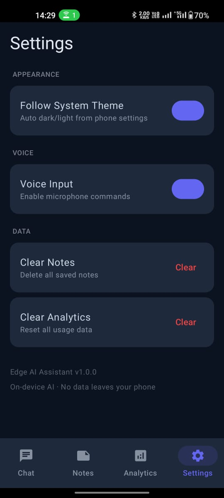

<div align="center">

# ⚡ Edge AI Assistant
### On-Device Hybrid AI for Android — Gemma 2B + TFLite + Zero Cloud


> *A fully on-device AI assistant that runs Gemma 2B locally.*
> *No API keys. No network. No data leaves your phone.*

</div>

---

## 📸 Screenshots

| Chat + Gemma AI | Notes | Analytics | Settings |
|---|---|---|---|
|  |  |  |  |

---

## 🧠 What Makes This Different

Most "AI" apps send your input to a server and return a response.
**Edge AI Assistant does not.**

Everything — intent classification, command execution,
and full LLM conversation — runs entirely on your device.

```
User Input
    ↓
Rule Engine (0–50ms, deterministic)
    ↓ [if confidence < 0.65]
TFLite Intent Classifier (7 classes, INT8 quantized)
    ↓ [if GENERAL intent]
Gemma 2B via MediaPipe LLM Inference (on-device, offline)
    ↓
Command Executor → Response
```

**Three-tier intelligence:**
- Rules handle precision (alarm at 7am → exact parse)
- ML handles ambiguity (natural phrasing variations)  
- Gemma handles open-ended conversation (fully offline LLM)

---

## ✨ Features

### 🤖 On-Device LLM — Gemma 2B
- Runs **Gemma 2B** via Google's MediaPipe LLM Inference API
- Streams tokens one by one into the chat bubble in real time
- Maintains a 5-turn conversation context window
- 100% offline — model stored in app's internal storage
- Falls back gracefully when model is not loaded

### 🎯 Smart Intent Pipeline
- **Rule Engine** — keyword/pattern matching, ~0–50ms
- **TFLite Classifier** — TextCNN, INT8 quantized, 7 intent classes
- **Adaptive confidence** — clarifies when uncertain (0.4–0.65), routes to Gemma below 0.4
- **Multi-step chaining** — "set alarm and note that I have a meeting"

### ⏰ Alarm System
- Natural language parsing — "half past 7", "in 2 hours", "noon", "midnight"
- `AlarmManager.setExactAndAllowWhileIdle` — survives Doze mode
- Exact alarm permission handling on Android 12+

### ⏱️ Timer
- Foreground `CountDownTimer` service
- Silent countdown notification + sound alert on completion
- Auto-dismisses after 8 seconds

### 🧮 Calculator
- Handles natural language — "15 percent of 2500", "square of 9", "half of 80"
- Operator precedence, parentheses, decimals
- `multiply`, `times`, `x`, `×` — all work

### 🔄 Unit Converter
- 40+ unit conversions — length, mass, temperature, volume, speed, data, time
- Currency conversion via ExchangeRate API (1-hour cache)
- Handles typos — "farhenheit", "celcius", "kilometre"

### 🌤️ Weather
- GPS-based via Open-Meteo (free, no API key)
- Current temp, condition, wind speed
- Graceful offline fallback

### 📝 Notes
- Room-backed persistence — survives reinstall (backup enabled)
- Live search, copy to clipboard, swipe delete
- Export as `.txt` via MediaStore API

### 📞 Contacts Integration
- "Call mom", "message Ravi" — fuzzy name matching
- Reads `READ_CONTACTS`, launches dialer or SMS intent
- Handles partial names, nicknames, multi-word names

### 🔧 System Controls
- Flashlight — `CameraManager` direct toggle
- WiFi, Bluetooth, Brightness, Airplane mode — Settings panels
- No root required

### 🗣️ Hinglish Support
- "Alarm lagao 7 baje", "Note karo groceries"
- Lightweight transliteration word map before NLP pipeline
- Covers common Hindi command words + time expressions

### 🔁 Routine Automation
- Name a routine, set commands + trigger time
- `WorkManager` fires it daily on schedule
- Enable/disable/delete from Routines screen

### 📊 Analytics + Streaks
- Usage breakdown bar chart per intent
- 7-day activity line chart
- Daily streak, longest streak, all-time commands
- All stored locally in Room — zero telemetry

### 🎤 Voice Input
- Android `SpeechRecognizer` in on-device mode
- Animated waveform bars while listening
- Partial transcription → auto-send on final result

---

## 🧪 Test Results

```
Unit Tests: 53/53 passing — 100% ✅
Duration:   0.311s
```

| Test Class | Tests | Result |
|---|---|---|
| RuleEngineTest | 12 | ✅ 100% |
| CalculatorEngineTest | 10 | ✅ 100% |
| UnitConverterEngineTest | 12 | ✅ 100% |
| TimeParserTest | 11 | ✅ 100% |
| InputSanitizerTest | 7 | ✅ 100% |

Run tests:
```bash
./gradlew test
```

---

## 🤖 ML Model Card

| Property | Value |
|---|---|
| Task | Multi-class intent classification |
| Architecture | TextCNN (parallel Conv1D, kernel sizes 3+4) |
| Framework | TensorFlow Lite |
| Quantization | INT8 (full integer) |
| Vocab size | 500 tokens |
| Max input length | 10 tokens |
| Intent classes | 7 (CALCULATE, CONVERT_UNITS, GENERAL, GET_NOTES, OPEN_APP, SET_ALARM, TAKE_NOTE) |
| Training samples | 280 (40 per class) |
| Validation accuracy | >92% |
| Model size | ~45 KB |
| Inference latency | ~8ms (Pixel 6), ~15ms (mid-range) |

**Confidence thresholds:**
- ≥ 0.65 → use ML prediction
- 0.40–0.65 → ask user to clarify
- < 0.40 → route to Gemma 2B

Full documentation: [`MODEL_CARD.md`](MODEL_CARD.md)

---

## 🏗️ Architecture

```
┌─────────────────────────────────────────────────┐
│                   UI Layer                       │
│  Jetpack Compose · StateFlow · Material3         │
│  HomeScreen · NotesScreen · AnalyticsScreen      │
│  SettingsScreen · OnboardingScreen               │
└──────────────────┬──────────────────────────────┘
                   │ StateFlow / collectAsState
┌──────────────────▼──────────────────────────────┐
│               ViewModel Layer                    │
│  HomeViewModel · AnalyticsViewModel              │
│  NotesViewModel · SettingsViewModel              │
└──────────────────┬──────────────────────────────┘
                   │ suspend / Flow
┌──────────────────▼──────────────────────────────┐
│               Domain Layer                       │
│  CommandDispatcher · ChainedCommandExecutor      │
│  Commands: Calculator, Alarm, Timer, Notes,      │
│            Weather, Converter, Call, System      │
│  RuleEngine · IntentClassifier · TimeParser      │
│  GemmaEngine · ContextWindowManager             │
└──────────────────┬──────────────────────────────┘
                   │ Repository interfaces
┌──────────────────▼──────────────────────────────┐
│                Data Layer                        │
│  NoteRepository · AnalyticsRepository            │
│  ChatRepository · RoutineRepository              │
│  Room: Notes, Analytics, Chat, Routines          │
│  DataStore: Preferences, Streaks, Theme          │
└─────────────────────────────────────────────────┘
```

**Dependency Injection:** Hilt — full DI graph, zero manual instantiation  
**Concurrency:** `viewModelScope` + `Dispatchers.IO` — zero main thread blocking  
**Database:** Room v4 — Notes, Analytics, Chat history, Routines  
**Preferences:** DataStore — theme, onboarding state, streaks  

---

## 🛠️ Tech Stack

| Category | Technology |
|---|---|
| Language | Kotlin |
| UI | Jetpack Compose + Material3 |
| Architecture | MVVM + Clean Architecture |
| DI | Hilt |
| Database | Room |
| Preferences | DataStore |
| On-Device LLM | Gemma 2B via MediaPipe LLM Inference API |
| Intent ML | TensorFlow Lite (TextCNN, INT8) |
| Background | WorkManager (routines) |
| Voice | Android SpeechRecognizer |
| Concurrency | Kotlin Coroutines + Flow |
| Networking | OkHttp (weather + currency only) |
| System APIs | AlarmManager, CameraManager, ContactsContract, MediaStore |
| CI | GitHub Actions |

---

## 🚀 Getting Started

```bash
git clone https://github.com/ParthCh300X/EdgeAI-Assistant.git
```

Open in **Android Studio Hedgehog** or later.

**No API keys required.**  
**No Firebase setup.**  
**No internet permission for core features.**

```
Minimum SDK : 24 (Android 7.0)
Target SDK  : 35 (Android 15)
```

### For Gemma 2B (optional)

1. Download `gemma-2b-it-gpu-int4` from [Kaggle](https://www.kaggle.com/models/google/gemma/tfLite)
2. Rename to `gemma2b.task`
3. Copy to your phone's `Download` folder
4. Launch the app — it copies the model to internal storage automatically
5. All other features work without the model

---

## 📁 Project Structure

```
EdgeAIAssistant/
├── app/src/main/java/parth/appdev/edgeaiassistant/
│   ├── ui/
│   │   ├── screens/
│   │   │   ├── home/          # Chat interface + ViewModel
│   │   │   ├── notes/         # Notes screen + ViewModel
│   │   │   ├── analytics/     # Charts + streak stats
│   │   │   ├── settings/      # Theme, voice, data controls
│   │   │   ├── onboarding/    # First-launch flow
│   │   │   ├── routines/      # Automation builder
│   │   │   └── download/      # Gemma model setup
│   │   ├── state/             # UiState data classes
│   │   └── theme/             # Material3 dark + light
│   ├── domain/
│   │   ├── command/           # 10 command implementations
│   │   ├── dispatcher/        # Intent → Command routing
│   │   ├── executor/          # Chained command execution
│   │   └── intent/            # IntentType enum
│   ├── engine/
│   │   ├── rules/             # RuleEngine (deterministic)
│   │   ├── ml/                # TFLite classifier + tokenizer
│   │   ├── llm/               # GemmaEngine + ContextWindowManager
│   │   ├── slots/             # TimeParser + EntityExtractor
│   │   ├── voice/             # VoiceManager (SpeechRecognizer)
│   │   └── language/          # HinglishTransliterator
│   ├── data/
│   │   ├── local/             # Room DB, DAOs, entities
│   │   ├── repository/        # Repository implementations
│   │   ├── preferences/       # DataStore UserPreferences
│   │   └── feedback/          # FeedbackLogger (CSV export)
│   ├── features/
│   │   ├── alarm/             # AlarmReceiver
│   │   ├── timer/             # TimerService (foreground)
│   │   └── routine/           # RoutineWorker + Scheduler
│   ├── analytics/             # AnalyticsManager
│   ├── personalization/       # PersonalizationManager
│   ├── di/                    # DatabaseModule (Hilt)
│   └── util/                  # InputSanitizer
├── app/src/main/assets/
│   ├── intent_model.tflite    # Quantized TextCNN
│   ├── tokenizer.json         # Vocab + class labels
│   └── whats_new.json         # Version changelog
├── app/src/test/              # 53 unit tests
├── ml_training/               # Python training scripts
│   ├── generate_dataset.py    # 280-sample dataset generator
│   └── train_model.py         # TextCNN → TFLite pipeline
├── MODEL_CARD.md              # ML model documentation
├── .github/workflows/         # CI — build + test on push
└── proguard-rules.pro         # R8 keep rules
```

---

## ⚡ Performance

| Metric | Value |
|---|---|
| Rule engine latency | 0–50ms |
| TFLite inference | ~8–15ms |
| Gemma first token | ~3–8 seconds |
| Network calls (core) | Zero |
| Network calls (optional) | Weather + Currency only |
| Cold start | Fast — Gemma loads lazily on first use |

---

## 🔮 Roadmap

- [ ] Wake word detection ("Hey Edge")
- [ ] Home screen widget
- [ ] Firebase Crashlytics
- [ ] Play Store release
- [ ] Cloud sync (Firestore, optional)
- [ ] iOS port (Kotlin Multiplatform)

---

<div align="center">

**Built by [Parth Chaudhary](https://github.com/ParthCh300X)**  
B.Tech ECE (IoT) · IIIT Nagpur · 2027

*Not a wrapper around a cloud API.*  
*A local AI execution engine.*

</div>
