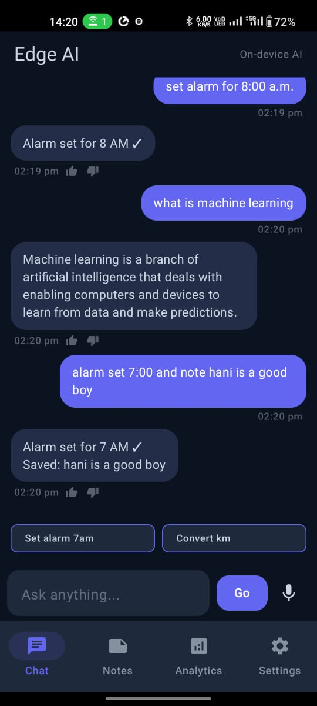
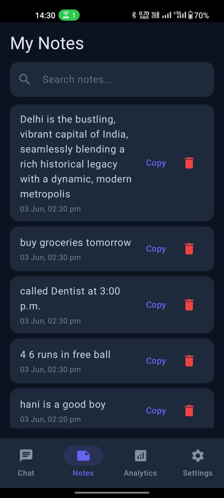
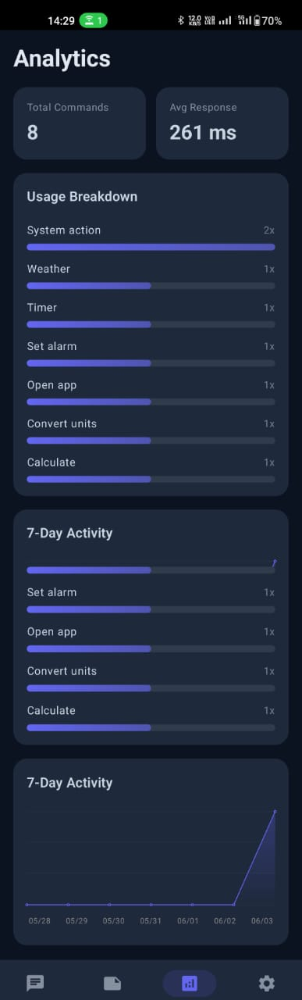

<div align="center">

# 🤖 Edge AI Assistant
### Offline Hybrid AI on Android — No Cloud. No APIs. No Network.


> *Everything runs on-device. Deterministic where precision matters.*
> *Probabilistic where language gets messy.*

</div>

---

## 📸 Screenshots

| Chat Interface | Voice Input | Analytics |
|---|---|---|
|  |  |  |

---

## 🧠 Core Idea

Most AI assistants send your data to a server.
Edge AI Assistant does not.

Every command — calculator, alarm, app launch, notes,
unit conversion — is processed entirely on-device using
a hybrid engine:
User Input
↓
Rule Engine (deterministic, ~0–50ms)
↓ [if confidence low]
TFLite Intent Classifier (probabilistic, quantized)
↓
Action Executor
↓
Response

**Rule engine handles precision tasks.**
**ML handles ambiguity.**
**Neither touches the network.**

---

## 🔑 Features

### 🧮 Calculator Engine
- Natural language parsing → expression evaluation
- Handles structured and free-form input
- Supports +, −, ×, ÷, percentages, multi-step expressions

### ⏰ Alarm System
- AlarmManager + BroadcastReceiver
- Exact alarms with system-level reliability
- Survives app kill

### 📱 App Launcher
- PackageManager integration
- Fuzzy matching — handles typos and partial names
- Disambiguation when multiple apps match

### 📝 Notes System
- RoomDB local persistence
- Instant save + retrieval
- Persistent across sessions

### 🔄 Unit Converter
- Rule-based parsing
- Common unit transformations — length, weight, temperature

### 🎤 Voice Input
- Android SpeechRecognizer in on-device mode
- Partial + final transcription handling
- No audio sent to any server

---

## 🤖 Machine Learning Layer

| Property | Detail |
|---|---|
| Framework | TensorFlow Lite |
| Model type | Lightweight intent classifier |
| Inference | On-device only |
| Optimization | INT8 quantization |
| Latency reduction | ~40% vs unquantized |
| Model size reduction | ~4x |
| Intent accuracy | >85% |

**The ML layer activates only when rule confidence is low.**
This hybrid approach gives speed where rules work
and flexibility where language is ambiguous.

---

## 📊 Analytics + Personalization

**Analytics Engine (stored locally via RoomDB):**
- Total commands executed
- Intent distribution across categories
- Execution latency per command (ms)
- Success / failure rate tracking

**Personalization Engine:**
- Tracks frequently used intents
- Recency + frequency weighted suggestions
- Smart command recommendations

---

## 🎨 UI

Built with Jetpack Compose.
Conversational chat interface — not a command panel.

- Message bubbles — user vs assistant
- Typing animation
- Smooth auto-scroll
- Voice interaction overlay

---

## 🧱 Tech Stack
Language        Kotlin
UI              Jetpack Compose
Architecture    MVVM + Clean Architecture
DI              Hilt
Database        RoomDB
ML              TensorFlow Lite (quantized INT8)
Concurrency     Kotlin Coroutines
System APIs     AlarmManager, PackageManager, SpeechRecognizer

---

## 🏗️ Architecture
UI Layer (Compose Screens)
↕ StateFlow
ViewModel Layer
↕
Domain Layer (UseCases)
↕
Data Layer
├── IntentEngine (Rules + TFLite)
├── RoomDB (Notes, Analytics, History)
└── System APIs (Alarm, Package, Speech)

Clean Architecture — no layer knows about
the implementation details of the layer above it.

---

## ⚡ Performance

| Metric | Value |
|---|---|
| Rule execution latency | ~0–50ms |
| ML inference latency | Optimized for real-time |
| Model size reduction | ~4x via quantization |
| Network calls | Zero |
| Cloud dependency | None |

---

## 🗂️ Repository Structure
EdgeAIAssistant/
├── app/src/main/
│   ├── ui/              # Compose screens + components
│   ├── viewmodel/       # ViewModels + UI state
│   ├── domain/
│   │   ├── usecase/     # Business logic
│   │   └── engine/      # Intent engine (rules + ML)
│   ├── data/
│   │   ├── local/       # RoomDB — notes, analytics
│   │   ├── ml/          # TFLite model loading + inference
│   │   └── system/      # AlarmManager, PackageManager wrappers
│   └── di/              # Hilt modules
└── assets/
└── intent_model.tflite

---

## 🚀 Getting Started

```bash
git clone https://github.com/ParthCh300x/EdgeAIAssistant.git
```

Open in Android Studio. No API keys. No Firebase setup.
No internet permission required. Run on any Android device.

Minimum SDK: 26

---

## 🔮 V2 Roadmap

- [ ] Advanced calculator — trig, power, logarithms
- [ ] Alarm UI — snooze, dismiss gestures
- [ ] Notes UI — edit, delete, tagging
- [ ] Enhanced NLP + entity extraction
- [ ] Expanded unit conversion
- [ ] Custom wake word detection

---

<div align="center">
<i>Not a feature list. A local AI execution engine.</i>
</div>
